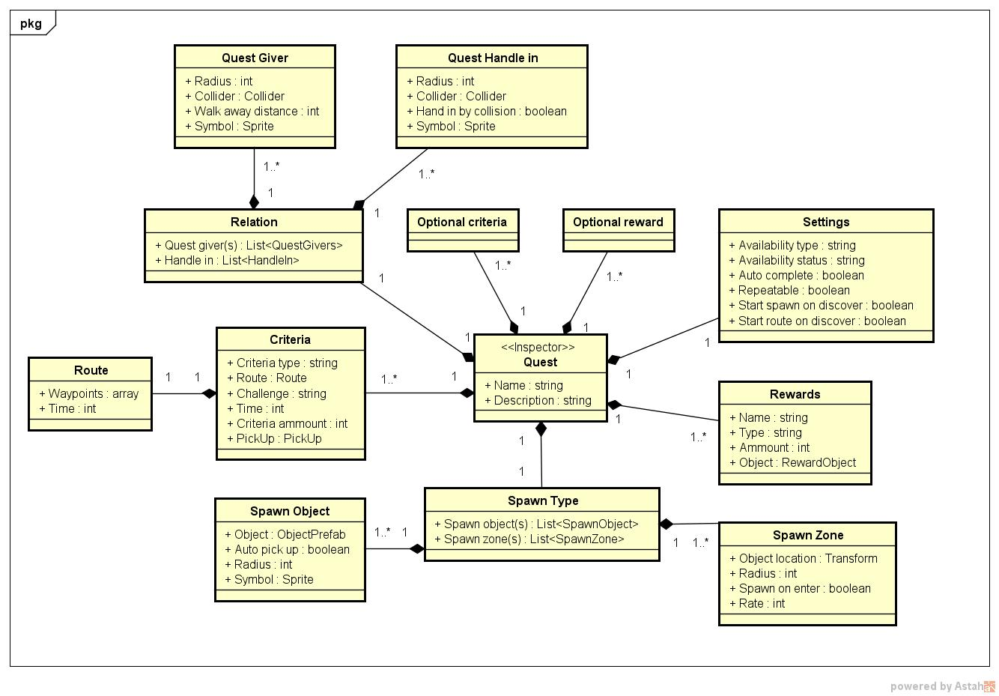

# Research Quest System

### High level details

- [ ] Quest management (log, map)
- [ ] Quest timer
- [ ] Quest triggers
- [ ] Quest rewards
- [ ] Quest content

### Med level details

- [ ] Edit quests directly in the inspector
- [ ] Structure and relate quests.
- [ ] Drag and drop your own quest line.
- [ ] Prefab based quest building.
- [ ] Visually editable quest structure
- [ ] Events for easy integration with your project.
- [ ] Extensive and thorough research.
- [ ] Optional criteria and rewards.
- [ ] Quest levels and thresholds allowing for complicated staged quests.
- [ ] Unique editor and inspector functionality.

### Low level inspector details

- Quest
	- Name
	- Description
	- Settings
		- Available 
			- Availability type (always, quest, region)
			- Availability status (complete, incomplete, start, open, notavailable, discovered, undiscovered)
		- \* Auto complete
			- \* Timed on zone discover
		- \* Repeatable
		- \* Start spawn on discover
		- \* Start route on discover
	- Relation
		- (Multiple) quest giver(s)
		- * (Multiple) handle in objects
	- (Multiple) criteria
		- Criteria type (delivery, pick-up, pick-up delivery)
		- Route
		- Challenge (easy, medium, hard)
		- \* Time
		- \* Criteria ammount
		- \* Criteria object 
	- \* Spawn type (zone, object)
		- \* (Multiple) spawn object(s)
		- \* (Multiple) spawn zone object(s)
	- (Multiple) rewards (easy, medium, hard)
		- Reward name
		- Reward type (recourse, item)
		- Reward ammount 
		- Reward object 
	- Optional criteria
	- Optional reward

- Quest giver
	- Radius
	- \* Sphere (collider for giver, deactivates radius)
	- Walk away distance 
	- Symbol

- Quest handle in
	- Radius
	- \* Sphere (collider for hand in, deactivates radius)
	- Hand in by collision
	- Symbol

- Spawn object
	- Object 
	- * Auto pick up
		- Radius
	- * Symbol

- Spawn zone
	- Object location
	- Radius
	- * Spawn on enter
	- * Rate

- Route
	- Waypoints
		- Time
		- A, B, C.. (x, y, z)

- Quest log

- Quest map

- Quest inventory

* = Optional	
